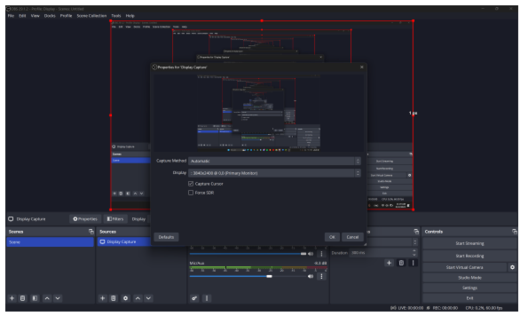

# OBS 设置

!!! Note

    这一章介绍了设置 OBS（Open Broadcaster Software）以记录屏幕活动的过程。

## 下载与安装

- **MacOS:** 从 [OBS 官方网站](https://obsproject.com/) 下载 OBS。

- **Windows:** 对于 Windows 用户，我们提供了 **OBS 30.1.2 版本** [这里](https://drive.google.com/file/d/1gas-fR4HJdp2_k8JtqTC98SBRA9sxWJV/view?usp=drive_link)。请下载我们提供的版本，因为更高版本可能需要设置兼容的 C++。

下载完成后：

1. 从下载文件夹中运行安装程序，并授予 OBS 安装所需的权限。

2. 保持 **默认设置**，通过点击“下一步”然后“完成”来继续安装向导。

## 设置 OBS WebSocket Server

- 在 OBS 的导航栏中点击 **“工具”**，然后选择 **“WebSocket 服务器设置”**。会弹出一个窗口。

- 勾选 **“启用 WebSocket 服务器”** 旁边的框，并 **取消勾选** **“启用身份验证”** 旁边的框。窗口应如下所示：

- 点击“应用”，然后“确定”。你应该返回到 OBS 的主页面。

## 添加显示捕获

- 回到 OBS 的主页，选择 **“场景”** 在“来源”下，点击 **“+”** 按钮，然后点击 **“显示捕获”**（在 MacOS 中是 **已弃用 -> 显示捕获**）。

- 确保“显示”设置为你的主显示器，你应该在画布上看到你的屏幕：

- 现在你可以关闭 OBS，当你启动 AgentNet 时，OBS 将自动开始录制。此外，你不必担心之前的配置被 AgentNet 改变。
